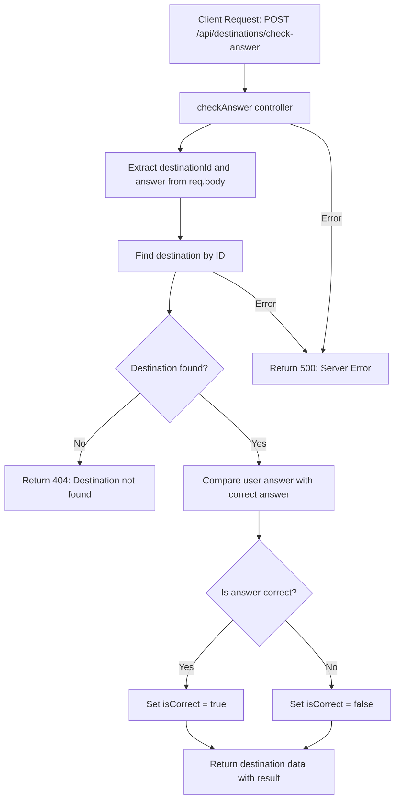
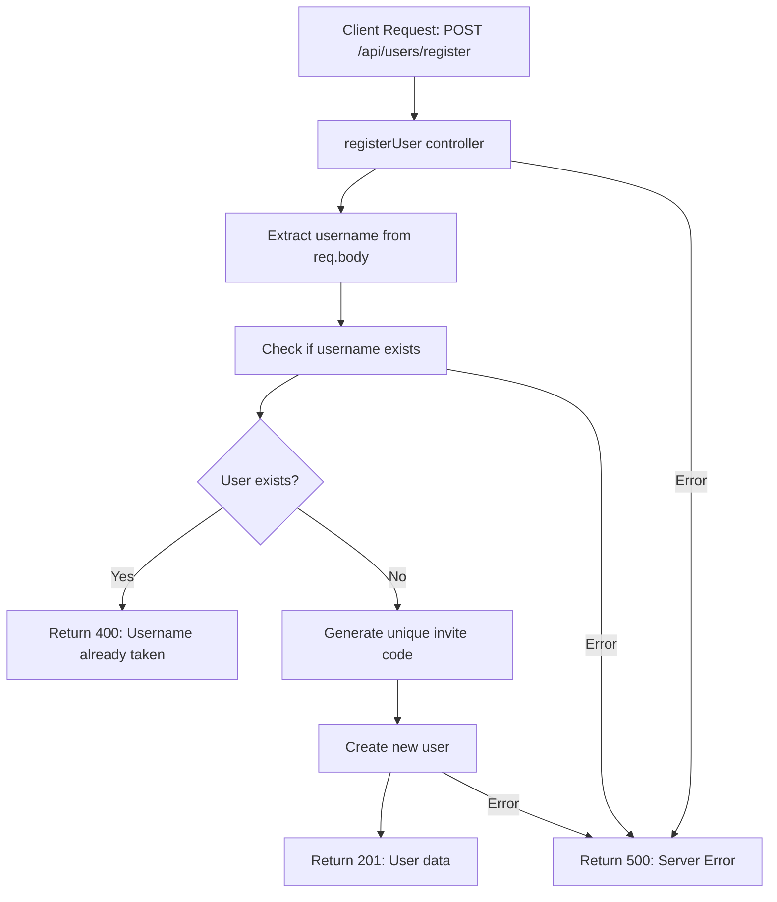

# City Cipher

City Cipher is a web-based game application that challenges players to identify cities through visual clues and hints. Test your geographical knowledge and explore cities around the world in this engaging guessing game.


## Architecture
The application follows a microservices architecture with:
- Frontend React application serving the user interface
- Backend Node.js API handling game logic and data management
- MongoDB database for storing city information and user progress
- Docker containers for consistent deployment

## Features
- Interactive city guessing gameplay
- Visual clues and hints system
- Score tracking and leaderboard
- User progress persistence
- Responsive design for mobile and desktop

## Tech Stack
- **Frontend**: React.js
- **Backend**: Node.js, Express.js
- **Database**: MongoDB Atlas
- **Containerization**: Docker & Docker Compose
- **Deployment**: Nginx (Frontend), Node.js server (Backend)

## Prerequisites
- Docker and Docker Compose installed
- Git
- Node.js (for local development)
- MongoDB Atlas account (for database)

## Installation

1. Clone the repository:
```bash
git clone https://github.com/yourusername/city-cipher.git
cd city-cipher
```

2. Set up environment variables:

Backend `.env`:
```env
MONGODB_URI=your_mongodb_connection_string
PORT=5000
NODE_ENV=development
```

Frontend `.env`:
```env
REACT_APP_API_URL=http://localhost:5000/api
```

3. Build and run the containers:
```bash
docker-compose up --build
```

The application will be available at:
- Frontend: http://localhost:80
- Backend API: http://localhost:5000

## Docker Services

### Backend Service
- Node.js application running on Alpine
- Exposes port 5000
- Handles API requests and game logic
- Connected to MongoDB Atlas

### Frontend Service
- React application served through Nginx
- Built using multi-stage Docker build
- Optimized production build
- Served on port 80

## API Response Format
[Document your API endpoints and response formats here]

## Architecture Design Rationale
- **Docker Containerization**: Ensures consistent development and deployment environments
- **Microservices**: Separates concerns between frontend and backend for better scalability
- **MongoDB Atlas**: Cloud-hosted database solution for reliable data persistence
- **Nginx**: Efficient static file serving for the frontend application

## Future Improvements
- Implement user authentication
- Add multiplayer functionality
- Expand city database
- Add difficulty levels
- Implement social sharing features
- Add progressive web app (PWA) support

## Testing

### Backend Testing
The backend uses Jest and Supertest for API endpoint testing. Tests cover user management and destination-related functionalities.

#### Running Tests
```bash
# Navigate to backend directory
cd backend

# Run tests once
npm test

# Run tests in watch mode
npm run test:watch
```

#### Test Coverage
The test suite covers:
- User Management
  - User registration
  - Invite code validation
  - Score updates
- Destinations
  - Random destination retrieval
  - Answer verification
  - Clue system

#### Test Environment
- Uses `mongodb-memory-server` for isolated testing
- Cross-environment testing support via `cross-env`
- Automated cleanup between test runs

To add new tests:
1. Create test files in the `backend/tests` directory
2. Follow the existing test structure using `describe` and `it` blocks
3. Use `supertest` for API endpoint testing
4. Run tests to ensure no regressions

## Acknowledgments
- MongoDB Atlas for database hosting
- Docker for containerization
- The open-source community for various tools and libraries used in this project


```mermaid


Flowchart for GET /api/destinations/random

flowchart TD
    A[Client Request: GET /api/destinations/random] --> B[getRandomDestination controller]
    B --> C{Count destinations}
    C --> D{count === 0?}
    D -- Yes --> E[Return 404: No destinations available]
    D -- No --> F[Get random destination using aggregation]
    F --> G{destination found?}
    G -- No --> H[Return 404: Failed to fetch]
    G -- Yes --> I[Extract question data: id and clues]
    I --> J[Get 3 more random destinations for options]
    J --> K{otherOptions.length < 3?}
    K -- Yes --> L[Return 400: Not enough destinations]
    K -- No --> M[Combine correct answer with decoys]
    M --> N[Shuffle options]
    N --> O[Return 200: questionData and shuffled options]
    
    C -- Error --> P[Return 500: Server Error]
    F -- Error --> P
    J -- Error --> P
```   
Flowchart for POST /api/destinations/check-answer




Flowchart for POST /api/users/register




Flowchart for GET /api/users/invite/:inviteCode

```mermaid
flowchart TD
    A[Client Request: GET /api/users/invite/:inviteCode] --> B[getUserByInviteCode controller]
    B --> C[Extract inviteCode from req.params]
    C --> D[Find user by invite code]
    D --> E{User found?}
    E -- No --> F[Return 404: User not found]
    E -- Yes --> G[Return 200: User data]
    
    B -- Error --> H[Return 500: Server Error]
    D -- Error --> H
    ```

Flowchart for POST /api/users/update-score
```mermaid
flowchart TD
    A[Client Request: POST /api/users/update-score] --> B[updateScore controller]
    B --> C[Extract username and isCorrect from req.body]
    C --> D[Find user by username]
    D --> E{User found?}
    E -- No --> F[Return 404: User not found]
    E -- Yes --> G{Is answer correct?}
    G -- Yes --> H[Increment user.score.correct]
    G -- No --> I[Increment user.score.incorrect]
    H --> J[Save updated user]
    I --> J
    J --> K[Return 200: Updated user data]
    
    B -- Error --> L[Return 500: Server Error]
    D -- Error --> L
    J -- Error --> L
```


